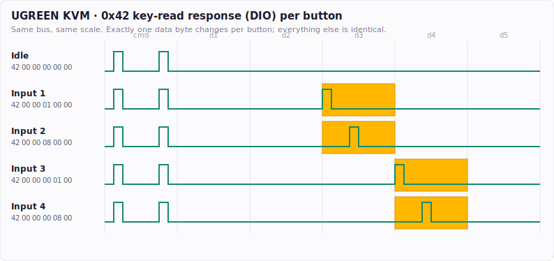

# UGREEN 4-port KVM control protocol (AiP1617 / TM1617)

Reverse-engineered with a logic analyzer (Saleae Logic 2, SPI decode) from a
UGREEN 4-in/1-out HDMI KVM's wired remote.

## Physical bus
The 4-button remote's mini-USB cable does **not** carry USB. It carries a
3-wire TM16xx-style serial bus to an **AiP1617** (a TM1617 clone) LED-driver +
key-scan chip. Cable pads: `GND, DIO, CLK, STB, VCC`.

- The KVM's MCU is the bus **master** (it drives CLK and STB).
- The chip is the **slave** (it responds to key-read polls, drives the LEDs).
- Framing: SPI-equivalent **CPOL=1, CPHA=1**, **LSB-first**, **8-bit**,
  **STB active-low**. CLK ~**138 kHz**. The KVM polls roughly every 5 ms.
- Data changes just after the CLK **falling** edge and is sampled on the
  **rising** edge. (So an emulating slave drives each bit on the falling edge.)

> **Cabling gotcha:** the port uses **all 5 Mini-USB pins**, including pin 4
> (ID), which carries a bus signal here. Most Mini-USB cables — even ones sold
> as "5-pin" — only wire 4 conductors and leave ID unconnected. Use the KVM's
> original remote cable (guaranteed 5-wire) or an SMD Mini-USB breakout, and
> verify all 5 conductors with a meter. See the main README for details.

## Key-scan read: command `0x42`
The master sends `0x42`, then clocks 5 response bytes out of the chip:

| State    | 0x42 response         | Changed byte       |
|----------|-----------------------|--------------------|
| Idle     | `42 00 00 00 00 00`   | none               |
| Button 1 | `42 00 00 01 00 00`   | data byte 3 = 0x01 |
| Button 2 | `42 00 00 08 00 00`   | data byte 3 = 0x08 |
| Button 3 | `42 00 00 00 01 00`   | data byte 4 = 0x01 |
| Button 4 | `42 00 00 00 08 00`   | data byte 4 = 0x08 |

To emulate a press: when the master sends `0x42`, return the 5 bytes with the
right bit set, and keep asserting it until the KVM switches.

## Active input: command `0xC0`
The master writes the button-backlight LED state with `0xC0 <bitmap>`:

| Bitmap | Active input |
|--------|--------------|
| 0x10   | Input 1      |
| 0x20   | Input 2      |
| 0x40   | Input 3      |
| 0x80   | Input 4      |

This is **free state feedback** — reading `0xC0` tells you the real active
input even when someone presses the physical button on the KVM. It enables a
closed loop: assert the key bit until `0xC0` confirms the target, then release.

## Other observed commands
`0x8B` (display control / brightness), `0x40` (data command, auto-increment
write), `0x03`, `0xC1 0x00`. These are master writes; the slave doesn't
respond, so an emulator can ignore them (just keep reading).
