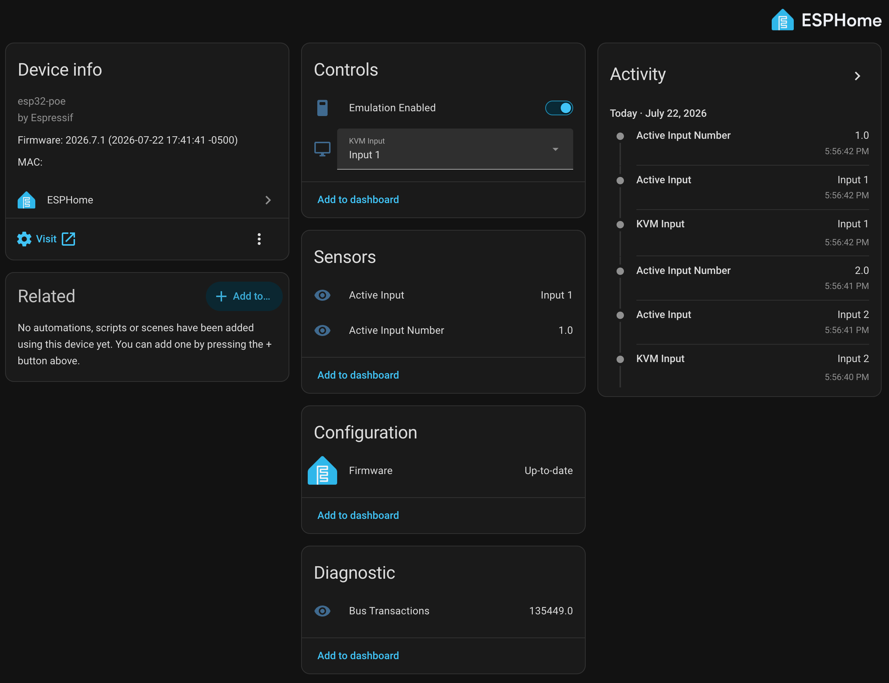

# ESPHome UGREEN KVM controller

Control a UGREEN 4-port HDMI KVM switch from Home Assistant — switch inputs
*and* read the real active input — by emulating its controller chip with an
ESP32 over its wired remote port. No relays, no button-tapping, no modification
to the KVM itself.

The 4-button remote isn't dumb switches: it's an **AiP1617 (TM1617) key-scan
chip** on a 3-wire serial bus. This firmware makes an ESP32 *become* that chip,
so it reads which input is active and drives "button presses" to switch inputs.
See [PROTOCOL.md](PROTOCOL.md) for the full reverse-engineering writeup.

## Features
- Switch inputs from Home Assistant / the built-in web UI (direct-select).
- Reads the **real active input** live — updates even when someone presses the
  physical button on the KVM box.
- Closed-loop: presses until the KVM's own LED feedback confirms the switch.
- Optional **"Off" trick**: leave one input physically unplugged and rename its
  select option to "Off" — selecting it switches to the dead port and drops the
  display entirely (handy for collapsing a Mac to a single screen for remote
  desktop). Off by default; the shipped config just exposes Input 1-4.
- Wired Ethernet (PoE) — rock-solid; WiFi's RF bursts glitch the bit timing.

## Hardware
- **Olimex ESP32-PoE** (or ESP32-PoE-ISO). Wired Ethernet is required — this
  did not work reliably on WiFi (TX bursts corrupt the ~138 kHz bit sampling).
- 4 jumper wires from the KVM's remote port to the ESP.

### Wiring (Olimex UEXT connector)
| KVM signal | ESP32 GPIO | UEXT pin |
|------------|-----------|----------|
| STB        | GPIO14    | 9 (HS2_CLK)  |
| CLK        | GPIO15    | 7 (HS2_CMD)  |
| DIO        | GPIO13    | 6 (I2C-SDA)  |
| GND        | GND       | 2            |

Tap these at the remote's cable pads (`GND/DIO/CLK/STB`) — the AiP1617 pins are
tiny; the pads are easy. **Share ground** between the ESP and the KVM. Remove
the original remote — the ESP is now the sole chip on the bus.

### ⚠️ You need all 5 Mini-USB conductors — most cables only have 4
This is the single most annoying gotcha. The KVM's control port uses **all five
Mini-USB pins** (the bus needs GND/DIO/CLK/STB, plus VCC). But "5-pin Mini-USB"
refers to the *connector shell*, not the wiring: the vast majority of Mini-USB
cables — including ones sold as "5-pin" — only populate **4 conductors**
(VBUS, D+, D−, GND) and leave **pin 4 (ID) unconnected**, because standard USB
doesn't use it. This KVM repurposes that ID line as a bus signal, so an
ordinary cable is physically missing the wire you need.

Options:
- **Easiest / most reliable:** cut the Mini-USB cable off the KVM's *original
  remote* and use that — it's guaranteed to have all 5 conductors wired. (This
  is what the author ended up doing after several "5-pin" cables turned out to
  be 4-wire.)
- Or solder your own leads directly to an SMD Mini-USB breakout board (all 5
  pads broken out), and plug that into the KVM.
- If you buy a cable, **cut it open and verify 5 wires before trusting it** —
  don't assume the listing. Meter continuity from each connector pin to a wire.

Whichever you use, confirm the ID pin actually reaches a wire; that pin carries
one of the CLK/STB/DIO signals on this KVM.

Pins are set at the top of `kvm_emulator.h`; change them there if you wire
differently. The Ethernet pins in the YAML are the standard Olimex ESP32-PoE
config (WROVER variant: change the clock to `GPIO0`).

## Setup
1. Copy `secrets.yaml.example` to `secrets.yaml` and fill in your values.
2. Put `kvm_emulator.h` in the same folder as `kvm-emulator.yaml`
   (your ESPHome config dir).
3. Flash `kvm-emulator.yaml` over USB the first time (disconnect Ethernet
   during USB flashing on the non-ISO board); OTA over Ethernet after.

## Usage (Home Assistant entities)
- **KVM Input** (select) — Input 1/2/3/4. Reflects the real active input
  (updates even when you press the physical button on the KVM box).
- **Active Input** / **Active Input Number** — live state (read-only).
- **Emulation Enabled** (switch) — safety gate. **OFF** = the ESP replies to
  key polls with all-zeros (reads state, never switches). **ON** = it can
  assert presses. Bring up with it OFF, confirm the active-input read is
  stable, then turn it ON.

## Bring-up / safety
1. Flash with **Emulation Enabled OFF**. Confirm **Active Input** tracks the
   KVM correctly and is stable. A logic analyzer on the bus should show the
   `0x42` response reading `42 00 00 00 00 00`.
2. Turn **Emulation Enabled ON**, pick a different input, and it should switch.

## Notes / limitations
- One ESP per 4-port (serial) KVM is recommended — the emulation is timing
  critical and doesn't share a CPU across multiple buses gracefully.
- Simple 2-in/1-out UGREEN KVMs use a *dumb single button* instead (short two
  pins) — those don't need this; a single optocoupler/relay per KVM works.
- Occasional raw bit-slips under Ethernet load are filtered out (valid-bitmap +
  two-read confirm) so the reported state stays clean; the closed loop
  self-heals any missed press. A hardware SPI-slave implementation would remove
  the slips entirely (future work).

## Disclaimer

This is a hobbyist project provided **as-is, with no warranty of any kind**
(see [LICENSE](LICENSE)). It involves modifying and electrically driving
hardware you own — cutting/soldering cables, tapping a live signal bus, and
having an ESP32 emulate the KVM's controller chip. You do this **at your own
risk**.

The author is **not responsible for any damage** to your KVM, computer,
displays, ESP32, or anything else, or for data loss, downtime, or other
consequences arising from use of this firmware or these instructions. This is
not affiliated with or endorsed by UGREEN. Double-check your wiring, share
grounds, and bring it up carefully (start with **Emulation Enabled OFF**).

## Credits
Protocol reverse-engineered from logic-analyzer captures. AiP1617 is a TM1617
clone; the TM16xx datasheet family is a useful reference.
